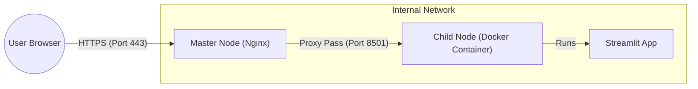
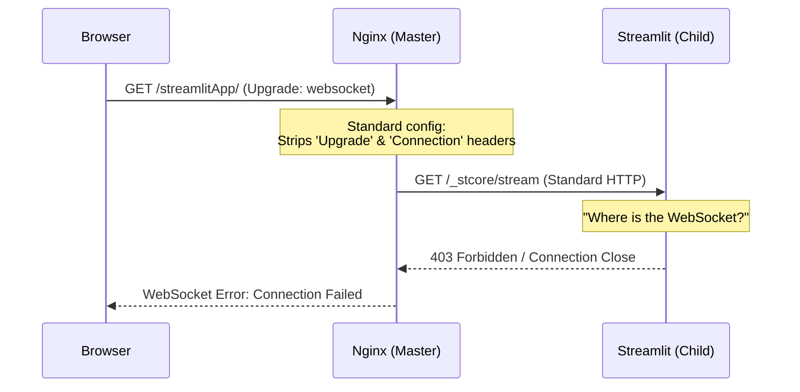
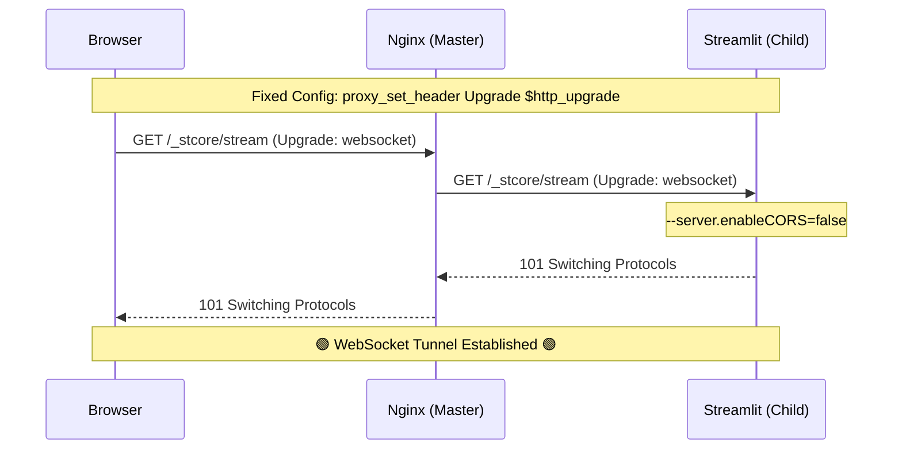

**TL;DR**: Streamlit apps use WebSockets for real-time communication. When deploying behind an Nginx reverse proxy, you need to add three lines to handle WebSocket upgrades and disable CORS enforcement in Streamlit.

**The fix:**
```nginx
location /streamlitApp/ { ## or just root "/"
    proxy_pass http://localhost:8501/;
    proxy_http_version 1.1;
    proxy_set_header Upgrade $http_upgrade;
    proxy_set_header Connection "upgrade";
```
Plus: `streamlit run app.py --server.enableCORS=false`

---

## The Problem

A couple of days back I had what seemed like a straightforward task: deploy a Streamlit app. I dockerized it: built the image, ran the container, but the app wouldn't load. The error:

```
WebSocket error: wss://example.com/streamlitApp/_stcore/stream failed
```

## The Setup

I had my container running on a child node behind an Nginx reverse proxy on a master node as shown below:


To expose the app publicly, I added a standard proxy rule based on existing configurations:

```nginx
location /streamlitApp/ {
    proxy_pass http://childNode:8501/;
}
```

It didn't work.

## Debugging

I tried deploying a minimal Streamlit app - same result. What puzzled me was that other apps worked perfectly with identical configurations. A simple React app worked without issues.

Thinking Nginx couldn't resolve the `/_stcore/stream` path, I added a specific rule:

```nginx
location /streamlitApp/ {
    proxy_pass http://childNode:8501/;
}

location /streamlitApp/_stcore/stream {
    proxy_pass http://childNode:8501/_stcore/stream;
} ## hand-holding it here
```

Still no luck.

What made it more confusing: the same app worked perfectly on my personal server running Traefik as a reverse proxy.

## Understanding the Root Cause



### Why React Works But Streamlit Doesn't

The fundamental difference lies in their architectures:

- **React apps**: Frontend makes HTTP requests to backend APIs → receives response → connection closes
- **Streamlit**: Maintains a persistent WebSocket connection to the Python backend for real-time communication

Streamlit has no traditional API layer. Every interaction (button clicks, slider movements) sends messages through WebSocket connections, with the Python script re-running and streaming new UI states back to the browser.

### The WebSocket Handshake Problem

When browsers want to upgrade from HTTP to WebSocket, they send specific headers:

```
Upgrade: websocket
Connection: upgrade
```

My Nginx configuration was **stripping these headers** when forwarding requests to the child node. Streamlit never knew the browser wanted WebSocket communication - it only saw regular HTTP requests.

### The CORS Issue

The multi-node setup created an origin mismatch:

- Browser connects to: `masterNode:443`
- Streamlit runs on: `childNode:8501`
- With CORS enforcement enabled (default), Streamlit blocks cross-origin WebSocket connections

## The Solution



Two changes were needed:

**1. Enable WebSocket handling in Nginx:**

```nginx
location /streamlitApp/ {
    proxy_pass http://childNode:8501/;
    proxy_http_version 1.1;
    proxy_set_header Upgrade $http_upgrade;
    proxy_set_header Connection "upgrade";
}
```

These lines tell Nginx to:
- Use HTTP/1.1 (required for WebSocket)
- Forward upgrade requests from the browser
- Signal connection upgrades to the backend

**2. Disable CORS enforcement in Streamlit:**

```bash
streamlit run app.py --server.enableCORS=false
```

This allows Streamlit to accept WebSocket connections from different origins.